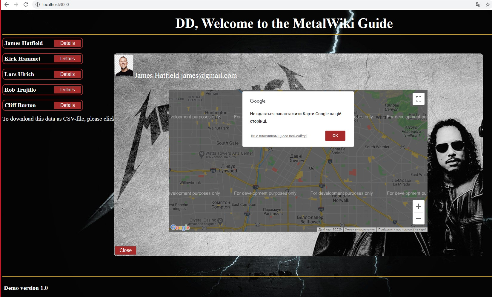

##tmTaskProject1
This is one-page application with some info of greatest band Metallica!
Application provides:   
   - data can be saved in .csv format by one button click.
   - by clicking 'Details' it shows geolocation of band's members using google map API;
### PRE-RUN 
Related back-end API must be started first:
https://github.com/Pavlotjg/tmTaskProject1BackEnd
####INSTALL
To install the app type in terminal command:  `npm install`
####RUN
 To start the app type in terminal command:  `npm start`
#### IMPORTANT !!!
DISABLE ADBLOCK TO DOWNLOAD csv-file !!!!

#### KNOWN ISSUES
Google map works well but it always show alert message (just click on it), because developer API key is in test mode (non-commercial version)
